制作多功能多启动多合一引导U盘
=====

本教程参考了以下帖子，并加入了帖子中没有的多个macOS镜像:

[Win10PE 2in1——2019年12月15日，附4小时视频教程及全套制作工具](http://bbs.pcbeta.com/viewthread-1775085-1-1.html)

[制作Legacy BIOS/UEFI双引导多Win10 FE 和 安装Mac OS的多合一U盘](https://www.feng.com/post/11689542)

## 制作好的U盘具有以下功能

- 支持LegacyBIOS/UEFI双引导PE，可安装Windows系统
- 支持Clover/OpenCore引导的单独EFI区，可安装macOS系统，并包括了High Sierra/Mojave/Catalina镜像
- U盘剩余的空间可拿来存文件

此教程在提供方法的同时，也是一个很好的思路，据此你可以制作出包含多个PE和系统镜像的工具盘。

## 准备工作

- macOS和Windows（也可以用虚拟机）
- 一个大容量的U盘(推荐16G或更大，我自己使用的U盘是64G)，根据自己的需求来，取决于你是否需要写入多个PE和macOS镜像
- 网上收集来的纯净PE系统
- macOS安装镜像
- 所需全部工具和文件链接: 链接: https://pan.baidu.com/s/1IZQL0qeyBFR3lgpXA2G0UA 提取码: y33r

## 制作方法

> **特别说明：**此处仅以我的SanDisk 64G U盘为例来说明详细步骤。
>
> 开始之前的计划：
>
> 写入一个支持LegacyBIOS/UEFI双引导的“微PE-2019修改版”，分配一个放置Clover/OpenCore引导文件的EFI区，还要写入三个macOS镜像，最后剩余的空间全部作为数据区存放文件。

### （一）初始化U盘

1. 在Windows系统下，插入U盘。*如果你U盘中有重要资料，请记得备份！*
   
   然后以管理员身份运行FbinstTool，*确保“选择磁盘” 中显示的是你的目标U盘。*
   
   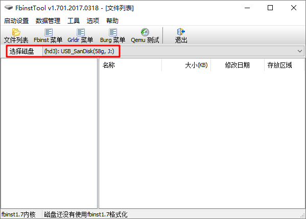
   
   

2. 点击主菜单上的 【启动设置-格式化】，勾选“重置磁盘”和“强行格式”，点击“格式化”。出现提示信息都点“是”，最后提示格式化成功，点击“确定”。至此U盘已经成功初始化！

   

### （二）将U盘格式化成UD扩展区

点击主菜单上的 【启动设置-格式化】，勾选“强行格式”和“UD扩展区”，双击“UD扩展区”右边的空格，自动获取并填入U盘的总容量。点击“格式化”，出现提示信息都点击“是”。最后提示格式化成功，点击“确定”。

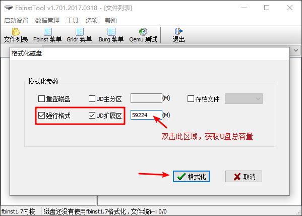

 

### （三）删除mbr.pt并执行碎片整理

右键点击FbinstTool窗口中的文件“mbr.pt”，选择”删除文件”。然后点击主菜单【数据管理-执行碎片整理】。

碎片整理很重要！因为在UD扩展区删除文件后一定要进行碎片整理，否则Legacy BIOS引导PE会出错！

### （四）导入mbr和message文件到UD区

右键点击FbinstTool右边窗口空白区，选择“导入文件”，依次分别导入grldr和message文件。成功后如图所示。

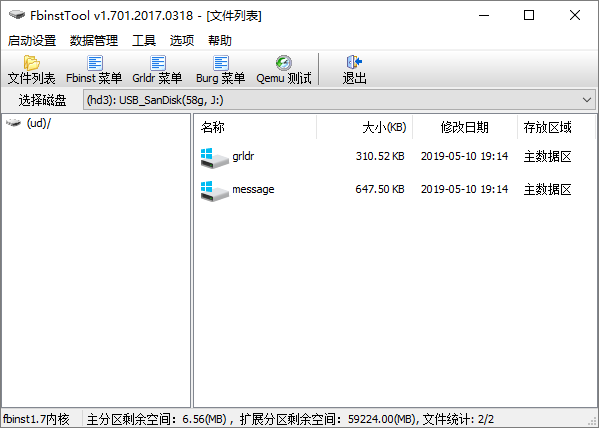

### （五）详细分区步骤

具体需求：因为mbr分区表最多支持四个主分区，所以我是这样分配的，一个用作传统BIOS引导的UD区，一个用作UEFI引导的主分区，一个存放Clover/OpenCore引导的主分区，写入三个macOS镜像的扩展分区（分成三个逻辑分区，分别写入High Sierra/Mojave/Catalina镜像），以及一个存放文件的主分区。这样刚好分完！

1. 首先创建一个“mbrPE.img/BootUSB”的分区镜像文件，其实这个文件只是用来占位的，作用是给后面要导入的传统BIOS引导PE预留空间，后面导入PE后会删除此文件，所以它的容量一定要大于你封装的PE系统的iso文件总大小。

   > 举个例子，假如你需要封装2个PE系统的话，且每个PE的iso文件大小为1G，那么此文件可设置的最小值为2G=2048M（记住只能比这个值大，不能比它小）。这里我用的“WePE2019.iso”大小为535M，所以建立此文件时的大小一定要大于这个535M值，此处我设置为了650M。
   >

   操作方法：右键点击FbinstTool右边窗口空白区，选择“新建文件”，为方便识别记忆命名为“mbrPE.img/BootUSB”(也可以根据你自己需要来命名)，输入文件大小650M，点击“确定”即可。

   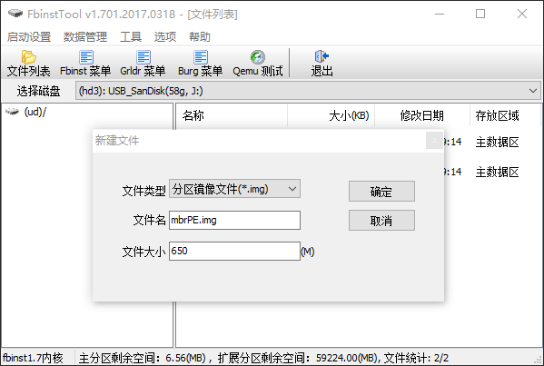

   

2. 用相同的方法，创建剩余的分区镜像文件。此处以我的情况来举例说明。

   > 分区具体计算方法：
   >
   > 当你创建完mbrPE.img/BootUSB后，FbinstTool窗口底部应显示“扩展分区剩余空间：58574(MB)”。
   >
   > 根据我的需求，我还需要创建两个主分区的img/BootUSB文件：
   >
   > - 第一个是用来写入支持uefi引导的PE分区，这里我还是用的“微PE-2019修改版”大小为535M，因为它支持传统BIOS/UEFI双引导。所以这个分区文件大小我依旧设置为650M。
   > - 第二个用来写入Clover/OpenCore引导文件的EFI分区，大小为300M。
   >
   > 另外，我还需要给用来写入三个macOS镜像(High Sierra/Mojave/Catalina)的扩展分区预留空间。根据镜像文件大小作出合理设置，推荐使用我的值。
   >
   > High Sierra镜像，分配空间设置为7G=7168M。
   >
   > Mojave镜像，分配空间设置为7G=8192M。
   >
   > Catalina镜像，分配空间设置为10G=10240M。
   >
   > 所以，目前总共还剩下的空间大小为：*58574M-650M-300M-7168M-8192M-10240M=32024M*  。
   >
   > 将这32024M设置为data.img/BootUSB的大小，也就是U盘剩余空间，拿来存文件使用。
   >
   > 有了具体的分配方案，操作就很简单了。

   操作方法：

   a. 创建一个名称为“data.img/BootUSB”的分区镜像文件，作为数据分区，大小32024M。

   b. 创建一个名称为“uefiPE.img/BootUSB”的分区镜像文件，作为UEFI引导分区，大小650M。

   c. 创建一个名称为“EFI.img/BootUSB”的分区镜像文件，作为存放Clover/OpenCore引导文件的EFI分区，大小300M。

   d. 此时，FbinstTool窗口底部显示扩展分区剩余空间应该是：25600(MB)。

   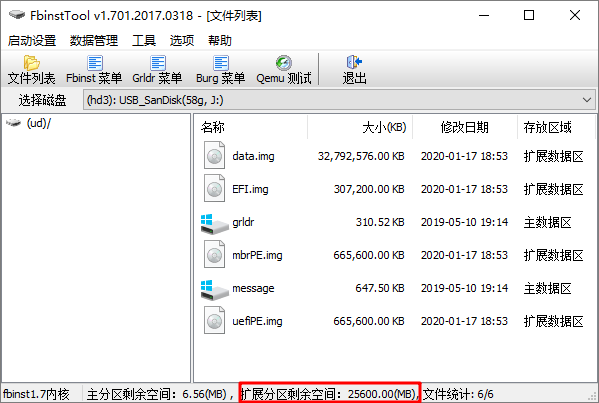

   
   
3. 将已经创建的img/BootUSB镜像文件转换为分区，其中mbrPE.img/BootUSB是用来占位的，不用转换。

   a. 右键点击data.img/BootUSB，选择“加入到分区表”。可以看到data.img/BootUSB分区图标变为绿色

   b. 用同样的方法，分别将uefiPE.img/BootUSB和EFI.img/BootUSB转变为分区。

   c. 全部转换完后，右键mbrPE.iso，选择“删除文件”并确认，完成应该是下面这个样子。

   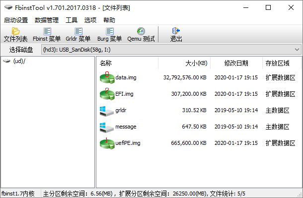

### （六）导入传统BIOS引导的PE系统到扩展分区

右键FbinstTool列表空白处，选择“导入文件(扩展分区)”，导入WePE2019.iso。导入完成后如图所示。

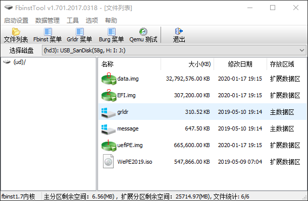

### （七）加入PE的grldr菜单

1. 打开工具包中提供的“单PE简单grldr菜单.txt”文件，请确认其中的“WePE2019.iso”文件路径无误。

   如果你需要写入多个PE的话，请按照“多PE豪华grldr菜单.txt”中提供的模板写法来制作。

2. 选择FbinstTool工具的“Grldr 菜单”，将窗口中显示的文本内容替换为“单PE简单grldr菜单.txt”中的所有内容。

   然后在空白区域点击右键，选择“保存(UTF-8)”。

### （八）格式化data.img/BootUSB分区

在“文件资源管理器”或“磁盘管理”中将data分区(按照你设置的分区大小，很好找到)格式化为exFAT格式，方便Windows和macOS都能读写数据。如果格式化提出出错，可以把U盘重新插拔一遍。

**好了，现在的U盘已经支持传统BIOS引导来安装Win系统了。可以点击“Qemu测试”来检测一下启动是否成功！**

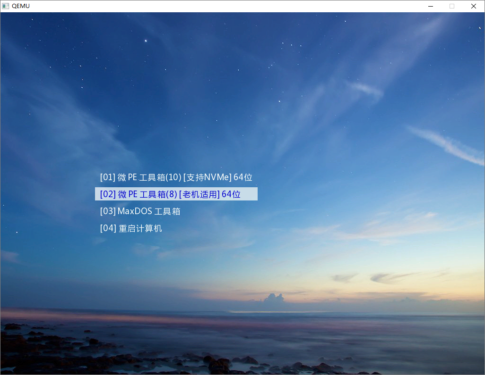

### （九）导入UEFI引导的PE系统

1. 在FbinstTool中将uefiPE.img/BootUSB转变为可见分区。

   a. 选择菜单【启动设置-分区表】，将uefiPE.img/BootUSB选中并拖到最上面，其序号自动变为0，点击“保存”。此时该	分区在Windows下的文件资源管理器中可见(根据你设置的分区大小即可快速找到)。

   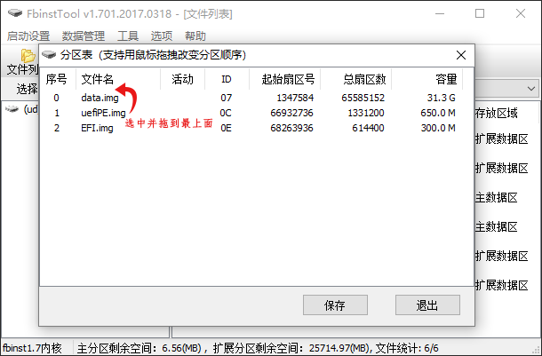

   

   b. 将上面找到的磁盘分区命名为“WEPE”，然后找一个支持UEFI的PE(比如此处我用”WePE2019.iso“，你也可	以选用支持UEFI的其他PE)并打开，将里面的文件全部提取到WEPE的盘。

   ​	提示：我使用Windows10 1803后，发现不需要“a.”这一步也能直接在文件资源管理器中显示分配的盘。
   
   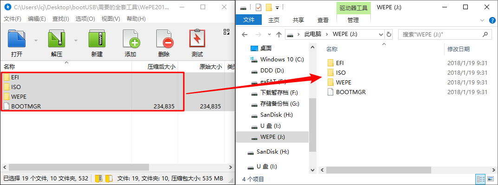
   
   

### （十）导入Clover/OpenCore引导文件到EFI分区

使用（九）中的方法，将准备好的Clover/OpenCore引导文件复制到EFI分区中。

### （十一）分配macOS镜像分区

1. 由（五）中分区计算可以知道还有25G的未使用空间，用于写入三个macOS镜像。

   打开工具包中的PartitionGuru分区工具，选中目标磁盘，鼠标选中空闲的25GB空间，右键“建立新分区”。
   
   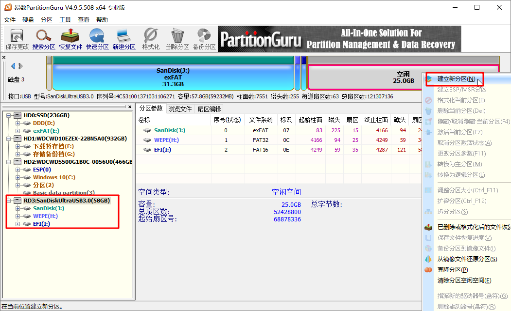

2. 在弹出窗口中，选中“扩展磁盘分区”，大小为25G，并勾选“对齐到扇区整数倍”，点击“确定”。该空闲空间将被格式化为扩展分区。

   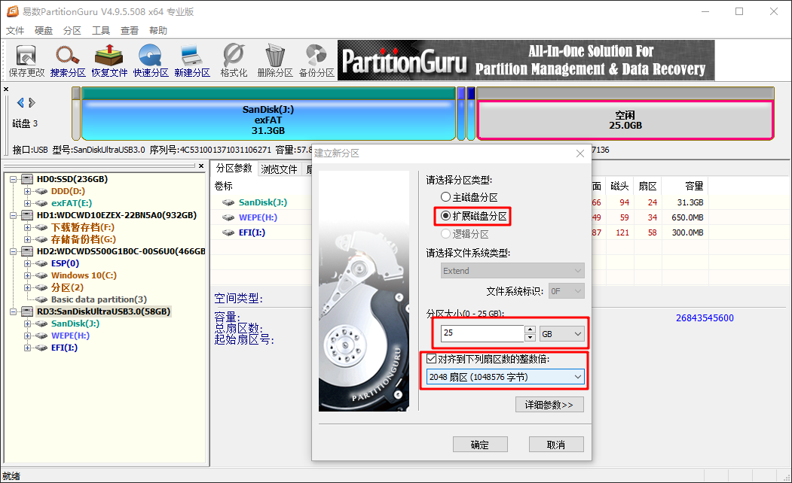

3. 再次选中空闲的25G分区，右键“建立新分区”，在弹出的窗口中，选中“逻辑分区”，文件系统随意(反正后面在macOS系统中也会重新格式化)，大小设置为7168MB，勾选对齐扇区。此时将分出一个未格式化的7G大小的逻辑分区用来写入High Sierra镜像。

   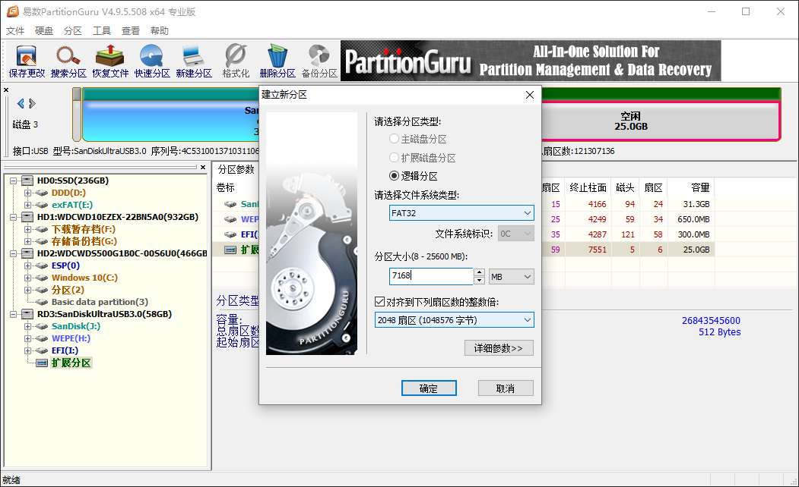

   

4. 同理，依次在空闲的扩展分区上分出用来写入Mojave和Catalina的分区，大小分别为8192MB和10240MB。

   最后点击PartitionGuru工具左上角的“保存更改”，工具会自动将分出的三个逻辑分区格式化并分配盘符。最终分区情况如图示。

   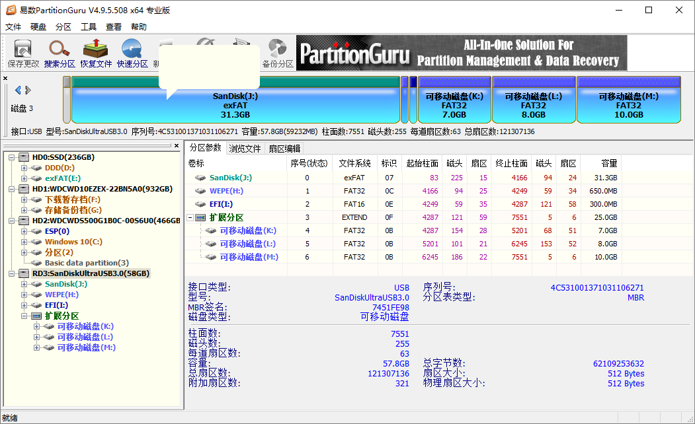

**此时，Windows系统下的工作就算完成了，现在的U盘已经可以通过传统BIOS和UEFI引导来安装Win系统了！**

### （十二）在macOS中抹盘

1. 在macOS系统下，插入U盘。运行”磁盘工具“，找到U盘上大小为7G的分区并抹掉，先选中格式为”Mac OS扩展（日志式）“，然后命名为”macOS13“。

2. 同理，依次抹掉剩下的的8G分区和10G分区。最终样子如图红框所示。

   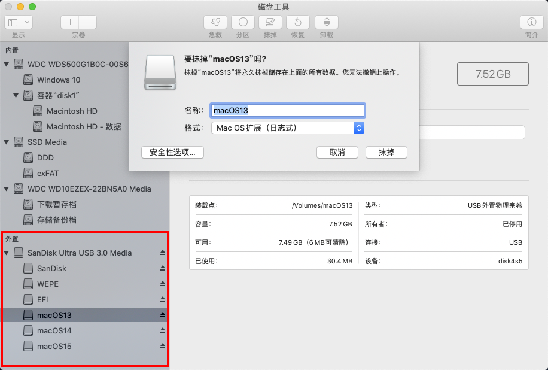

### （十三）使用gibMacOS获取原版macOS安装镜像

1. 解压工具包中的“gibMacOS-master.7z”文件，双击打开“gibMacOS.command”。
   
   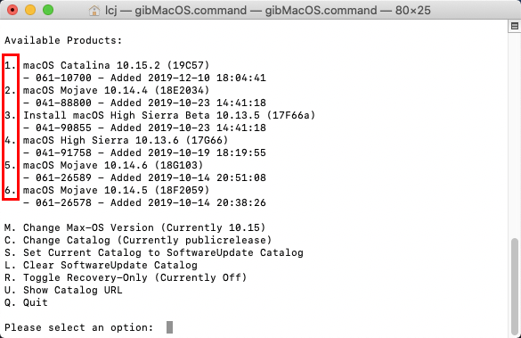
   
   

2. 然后输入对应版本前的数字来下载相应镜像。默认会下载到当前目录的"macOS Downloads"文件夹中。

   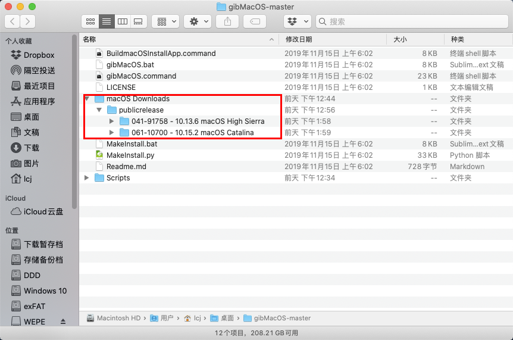

   

3. 双击打开“BuildmacOSInstallApp.command”，将已下载好的镜像文件夹拖到当前打开的终端窗口中，会自动制作并生成可安装程序(名称为“安装XXX”)。

   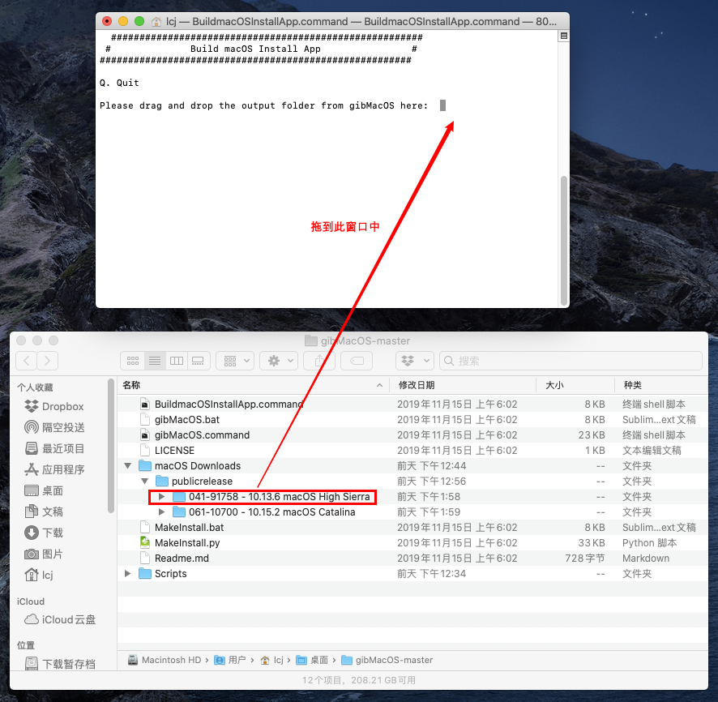

   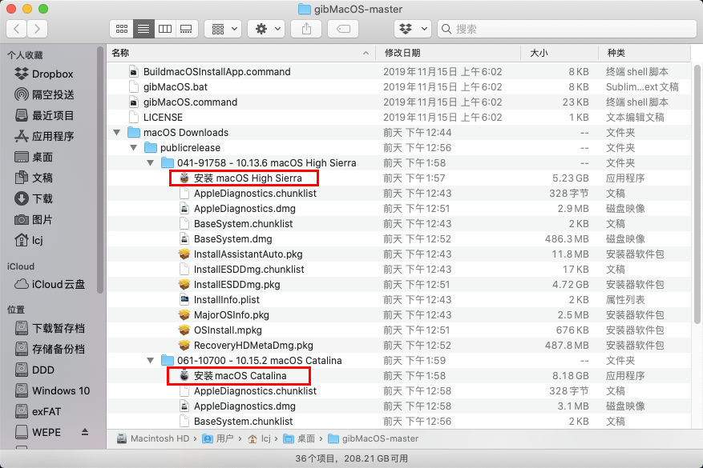

   

4. 重新打开终端，输入”sudo “(不含引导，sudo后面有个空格)，选择你先前制作好的上图红框中的文件(如"安装 macOS High Sierra")，右键选择”显示包内容“，展开Contents>Resource>，找到名为”createinstallmedia“的文件，将其拖到终端窗口中。并继续输入”--volume /Volumes/macOS13“(其中的macOS13卷名都是之前已经命名好的)，然后回车，提示输出密码请输入你自己的mac系统密码，提示输入Y继续，将会自动开始写入安装程序到U盘的macOS13分区中，窗口中会显示一个大概的进度，直到出现成功的提示。

   最终写入成功后，桌面上的那个"macOS13"盘也会自动改名为”Install macOS High Sierra“。

   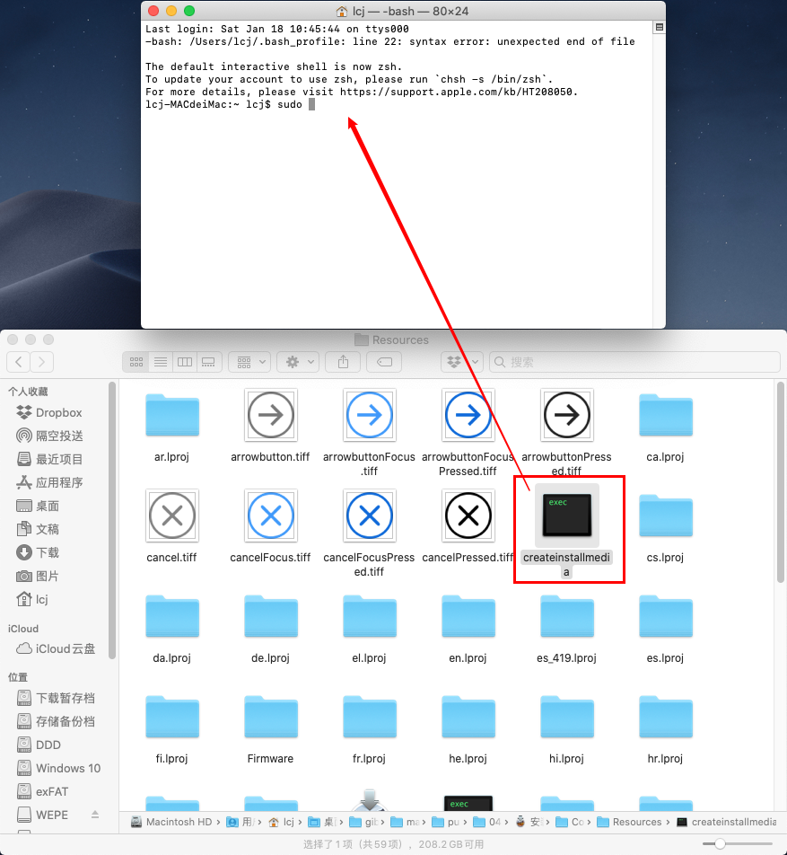

   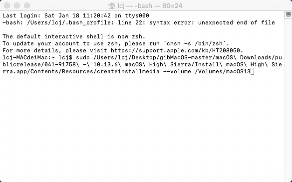

   

5. 使用相同的方法，写入Mojave和Catalina的镜像到U盘。

   **提示：**如果你的安装程序位于”应用程序”文件夹中，也可以使用下面的官方安装命令，后面的卷名一样需要根据你实际情况来输入(请参考苹果官方说明：[如何创建可引导的 macOS 安装器](https://support.apple.com/zh-cn/HT201372))。

   推荐使用拖放文件的方式，这样不容易使路径出错!

   High Sierra：

   `sudo /Applications/Install\ macOS\ High\ Sierra.app/Contents/Resources/createinstallmedia --volume /Volumes/macOS13`

   Mojave：

   `sudo /Applications/Install\ macOS\ Mojave.app/Contents/Resources/createinstallmedia --volume /Volumes/macOS14`

   Catalina：

   `sudo /Applications/Install\ macOS\ Catalina.app/Contents/Resources/createinstallmedia --volume /Volumes/macOS15`

**至此，所有工作都已完成。你成功制作了一个多用途U盘，现在可以用它来安装Windows和macOS了！！！**

## 最后

本文步骤看似较多，也写了很久。目的只是为了能详细地贴出每一个步骤，来让每个参考教程的人都能制作成功。其实只要认真查看教程后，自己照着操作一遍，除去写入镜像的时间，基本上几分钟就能操作完所有步骤。

