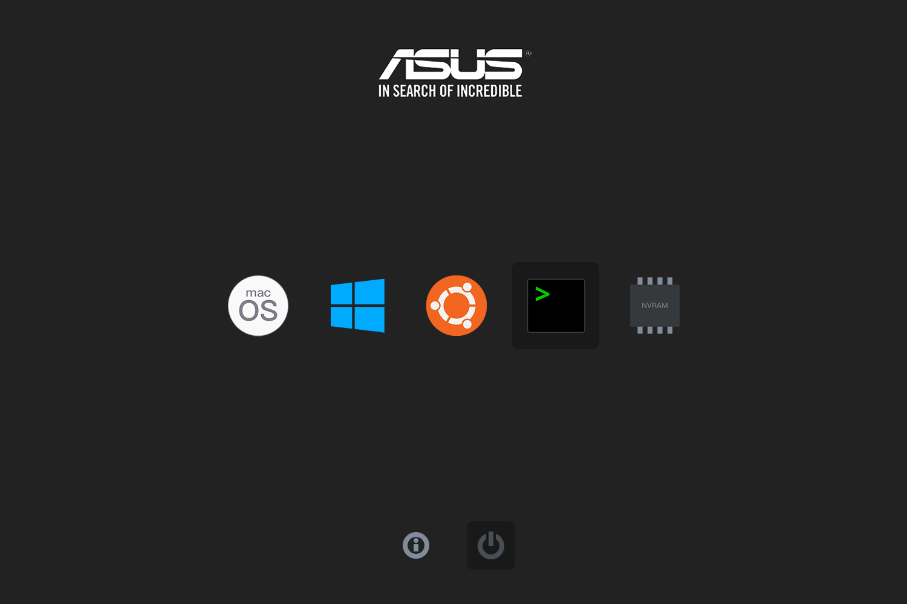
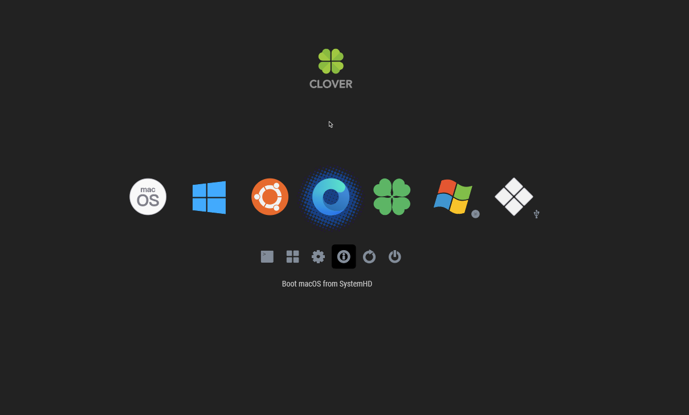
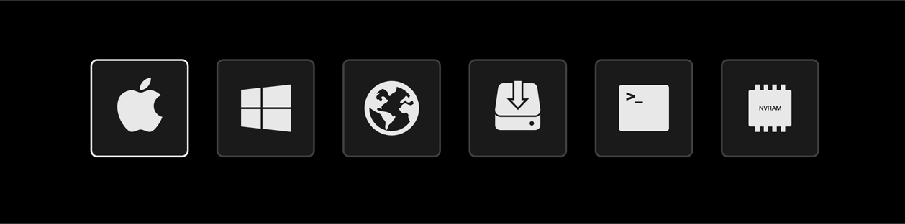

EFI-ASUS-B250M
========

   

中文 | [English](README_en.md)

此EFI配置在我自己的台式机上所有部件都完美工作，不敢说百分百完美，但完成度非常之高！如果你的配置恰好和我一样或类似，你可以根据自己的需要来选用。理论上来说，只要你是100系或以上主板，都可以使用我的EFI作为模板来配置。

***请从[Releases](https://github.com/lichongjia/EFI-ASUS-B250M/releases)下载最新版。***

[Docs](Docs/)文件夹有一些有用的提示和建议！

附加教程：[制作多功能多启动多合一引导U盘](Docs/BootUSB.md)

## 硬件详情

| 配置     | 产品型号                               |
| :------- | :------------------------------------- |
| 主板     | ASUS Prime B250M-A                     |
| 处理器   | Intel Core i5-7500 @ 3.40GHz           |
| 内存     | Kingston 8GBx3 DDR4 2400MHz            |
| 硬盘     | WD Blue SN500 NVMe SSD 500G            |
| 核显     | Intel HD Graphics 630（id=0x59120003） |
| 独显     | AMD Readon HD7850                      |
| 声卡     | Realtek ALC887（id=52）                |
| 有线网卡 | Realtek RTL8111H                       |
| 无线网卡 | Broadcom BCM4331（WiFi+Bluetooth）     |
| 显示器   | Lenove ThinkVison P24Q                 |

## OpenCore

## Clover

## OpenCanopy-Icons Preview
**Pure:**

    

**Jianfengzhi:**

    

## 多系统引导

多系统引导使用rEFInd管理OpenCore。(macOS(OpenCore), Windows10, Ubuntu)

详细教程已发到远景论坛。

## 更新说明

* 已转OpenCore！后续更新会将主要精力放在OpenCore上。
* Clover版本已经非常完美了，后续可能不会有大的改动，仅更新版本号和驱动。
* 详细更新日志请查看[Changelog](Changelog.md)。

## 关于

如果这个项目对你有帮助，你可以捐赠或者关注一下我的公众号。

如果你在安装或使用过程中有任何疑问，可以通过主页的联系方式私信我。也许我可以给你提供一些帮助!

